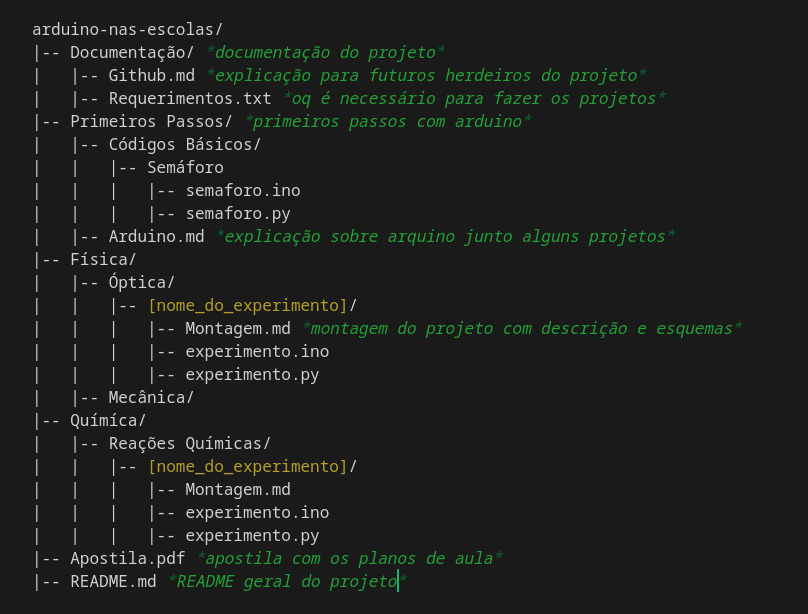

# Organização do repositório

Estrutura das pastas

## Issues, Branches e Pull Requests

Trabalhamos com conceitos emprestados do [Git Flow](https://medium.com/trainingcenter/utilizando-o-fluxo-git-flow-e63d5e0d5e04).

Para cada projeto (experimento) será criada uma issue e consequentemente uma branch, em seu nome explicando e atribuindo a pessoa que será responsável por ele.

Quando feito, testado e aprovado, será feito o commit e em seguida o Pull Request.

## Commits Semânticos

São uma padronização que muitas empresas usam e ajuda a entender melhor o que foi feito naquela alteração. [Leia mais sobre.](https://www.conventionalcommits.org/en/v1.0.0/).

Alguns dos prefixos usados são:

- feat – a new feature is introduced with the changes
- fix – a bug fix has occurred
- chore – changes that do not relate to a fix or feature and don't modify src or test files (for example updating dependencies)
- refactor – refactored code that neither fixes a bug nor adds a feature
- docs – updates to documentation such as a the README or other markdown files
- style – changes that do not affect the meaning of the code, likely related to code formatting such as white-space, missing semi-colons, and so on.
- test – including new or correcting previous tests
- perf – performance improvements
- ci – continuous integration related
- build – changes that affect the build system or external dependencies
- revert – reverts a previous commit

Referência retirada do repositório [eng-software-2](https://github.com/tacianosilva/eng-software-2/blob/master/docs/doc-gitflow.md)

