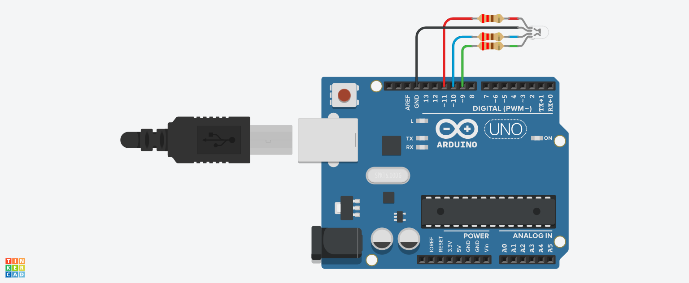

# LED RGB - Cores

## Descrição

Este projeto busca observar o comportamento do fenômeno óptico da junção de luzes com cores diferentes, através do uso de um LED RGB, acionado por meio de saídas PWM. Ele foi criado utilizando o Tinkercad, uma plataforma online para prototipagem eletrônica.

## Link do Projeto

Você pode acessar o projeto diretamente através do link abaixo:

[Cores - led rgb no Tinkercad](https://www.tinkercad.com/things/9J69NgMXr9z/editel?returnTo=%2Fdashboard%2Fdesigns%2Fcircuits&sharecode=YM9-cacaKSPoyr_gX_bWgxBYoXPmpPIrz3jTTxIlRWE)

## Características

- **Codificação em Blocos**: A versão do simulador utiliza uma interface de codificação em blocos, facilitando o entendimento do funcionamento e lógica por trás do projeto.
- **Componentes Utilizados**: O projeto utiliza um LED RGB para emitir a luz da cor desejada.
- **Interatividade**: A simulação permite explorar o comportamento óptico da junção de luzes coloridas por meio da variação dos valores de saída em cada pino.

## Como Usar

1. Acesse o link do projeto.
2. Explore a interface de codificação em blocos, variando valores de saída e de tempo.
3. Você pode modificar o código e testar diferentes combinações de valores para obter cores específicas.

## Materias

| Quantidade | Descrição        |
| ---------- | ---------------- |
| 1          | Arduino Uno R3   |
| 1          | LED RGB          |
| 3          | Resistor 220 Ω   |

## Montagem do Projeto

