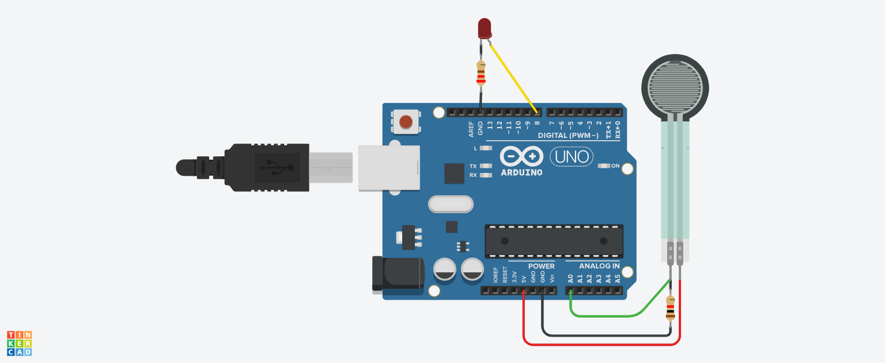

# Sensor de força

## Descrição

Este projeto visa o estudo da força, através de um sensor que varia seu valor de saída a medida que há força aplicada no mesmo, além disso também há um retorno visual com o acionamento do LED a partir de um certo limite de força. Ele foi criado utilizando o Tinkercad, uma plataforma online para prototipagem eletrônica.

## Link do Projeto

Você pode acessar o projeto diretamente através do link abaixo:

[Sensor de força no Tinkercad](https://www.tinkercad.com/things/5XiOPpyQDa7/editel?returnTo=%2Fdashboard%2Fdesigns%2Fcircuits&sharecode=1tZx_Ejkt-N4k5cY3nZYNzthaXdXqlfZDSOv74xlg90)

## Características

- **Codificação em Blocos**: A versão do simulador utiliza uma interface de codificação em blocos, facilitando o entendimento do funcionamento e lógica por trás do projeto.
- **Componentes Utilizados**: O projeto utiliza um sensor de força que mede a força aplicada nele e um LED que é acionado quando essa força é maior que o limite definido no código.
- **Interatividade**: A simulação permite vizualizar a variação do valor lido pelo sensor através do monitor serial além de alterar o valor limite para o acionamento do LED.

## Como Usar

1. Acesse o link do projeto.
2. Explore a interface de codificação em blocos, variando o valor limite para o acionamento do LED.
3. Você pode modificar o código adicionando ou alterando as funcionalidades já existentes.

## Materias

| Quantidade | Descrição        |
| ---------- | ---------------- |
| 1          | Arduino Uno R3   |
| 1          | LED              |
| 1          | Sensor de força  |
| 1          | Resistor 1 kΩ    |
| 1          | Resistor 220 Ω   |

## Montagem do Projeto

