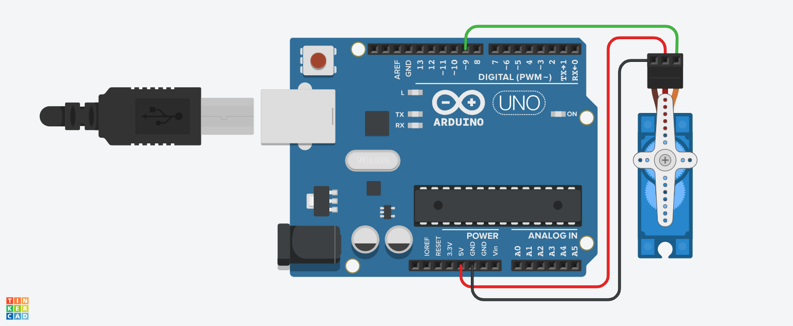

# Servomotor - ângulos

## Descrição

Este projeto busca tratar de forma prática e visual, os conhecimentos acerca de ângulos, a partir do uso do servomotor. Ele foi criado utilizando o Tinkercad, uma plataforma online para prototipagem eletrônica.

## Link do Projeto

Você pode acessar o projeto diretamente através do link abaixo:

[Servomotor - ângulos no Tinkercad](https://www.tinkercad.com/things/ihFTJxoK3R6/editel?returnTo=%2Fdashboard&sharecode=xdFQix-XCh66tT7lP3372PfNzGmalRCQVMZ4ZwCaA2E)

## Características

- **Codificação em Blocos**: A versão do simulador utiliza uma interface de codificação em blocos, facilitando o entendimento do funcionamento e lógica por trás do projeto.
- **Componentes Utilizados**: O projeto utiliza um micro servomotor para realização dos giros orientados pelos ângulos.
- **Interatividade**: A simulação permite observar a relação direta entre o valor de um ângulo e seu respectivo giro.

## Como Usar

1. Acesse o link do projeto.
2. Explore a interface de codificação em blocos para entender a lógica por trás do servomotor.
3. Você pode modificar o código e testar diferentes valores para os ângulos.

## Materias

| Quantidade | Descrição        |
| ---------- | ---------------- |
| 1          | Arduino Uno R3   |
| 1          | Micro Servomotor |

## Montagem do Projeto

