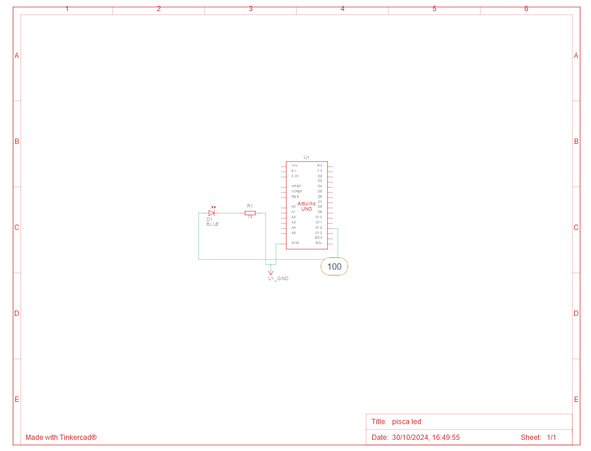

# Pisca LED

## Descrição

Este projeto é um experimento de pisca LED, desenvolvido para demonstrar o funcionamento de um LED intermitente. Ele foi criado utilizando o Tinkercad, uma plataforma online para prototipagem eletrônica.

## Link do Projeto

Você pode acessar o projeto diretamente através do link abaixo:

[Pisca LED no Tinkercad](https://www.tinkercad.com/things/hImlypsG0q7-pisca-led/editel?returnTo=https%3A%2F%2Fwww.tinkercad.com%2Fdashboard%2Fdesigns%2Fcircuits)

## Características

- **Codificação em Blocos**: A versão do projeto utiliza uma interface de codificação em blocos, facilitando a compreensão da lógica por trás do pisca LED.
- **Componentes Utilizados**: O projeto utiliza um LED para criar o efeito de piscar.
- **Interatividade**: A simulação permite observar como o LED acende e apaga, imitando o funcionamento de um sinalizador.

## Como Usar

1. Acesse o link do projeto.
2. Explore a interface de codificação em blocos para entender a lógica por trás do pisca LED.
3. Você pode modificar o código e testar diferentes intervalos de piscar.

## Materiais

| Quantidade | Descrição      |
| ---------- | -------------- |
| 1          | Arduino Uno R3 |
| 1          | LED            |
| 1          | Resistor 220 Ω |

## Esquema do Projeto

## Características

- **Codificação em Blocos**: A versão do projeto utiliza uma interface de codificação em blocos, facilitando a compreensão da lógica por trás do pisca LED.
- **Componentes Utilizados**: O projeto utiliza um LED para criar o efeito de piscar.
- **Interatividade**: A simulação permite observar como o LED acende e apaga, imitando o funcionamento de um sinalizador.

## Como Usar

1. Acesse o link do projeto.
2. Explore a interface de codificação em blocos para entender a lógica por trás do pisca LED.
3. Você pode modificar o código e testar diferentes intervalos de piscar.

## Materiais

| Quantidade | Descrição      |
| ---------- | -------------- |
| 1          | Arduino Uno R3 |
| 1          | LED            |
| 1          | Resistor 220 Ω |

## Esquema do Projeto

