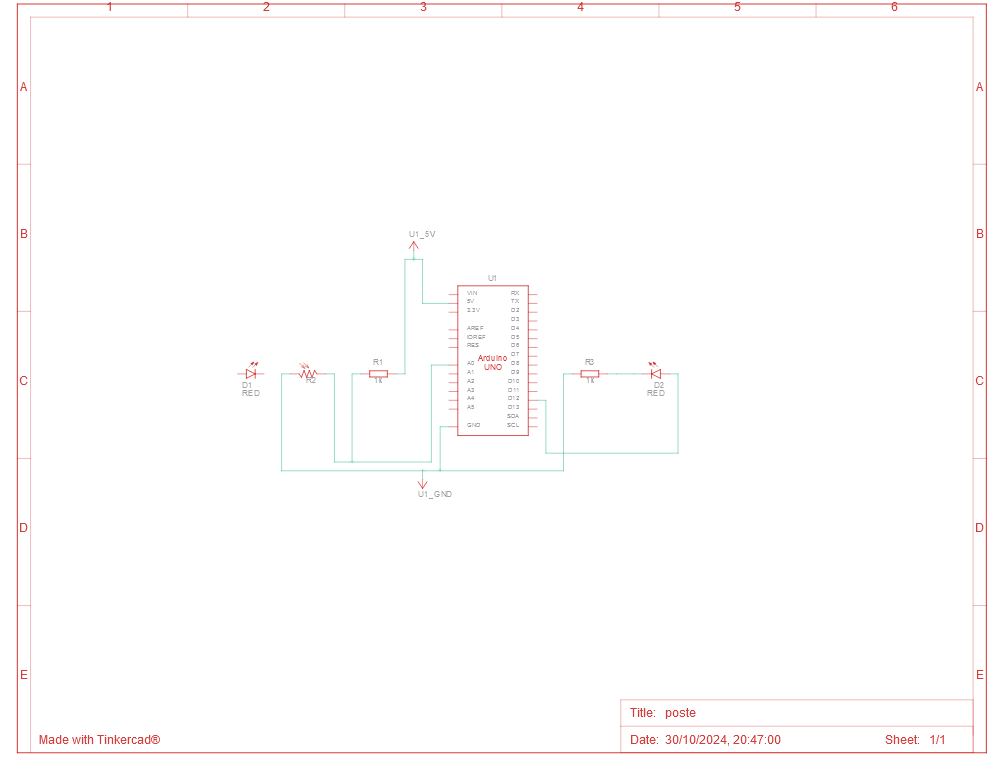

# Poste com LED Simples

## Descrição

Este projeto é um poste simples desenvolvido para demonstrar o funcionamento de um sinal de iluminação (irá ser feito um poste como demonstração). Ele foi criado utilizando o Tinkercad, uma plataforma online para prototipagem eletrônica.

## Link do Projeto

Você pode acessar o projeto diretamente através do link abaixo:

[Poste com LED Simples no Tinkercad](https://www.tinkercad.com/things/bsHPoRtNdC5-poste)

## Características

- **Codificação em Blocos**: A versão do poste utiliza uma interface de codificação em blocos, facilitando o entendimento do funcionamento e lógica por trás do projeto.
- **Componente Utilizado**: O projeto utiliza um LED para representar a iluminação do poste.
- **Interatividade**: A simulação permite observar como o LED muda de estado, imitando o funcionamento real de um poste de iluminação.

## Como Usar

1. Acesse o link do projeto.
2. Explore a interface de codificação em blocos para entender a lógica por trás do funcionamento do poste.
3. Você pode modificar o código e testar diferentes sequências de iluminação.

## Materiais

| Quantidade | Descrição      |
| ---------- | -------------- |
| 1          | Arduino Uno R3 |
| 1          | LED            |
| 2          | Resistor 1 kΩ  |
| 1          | Fotorresistor  |

## Esquema do Projeto

 \_
