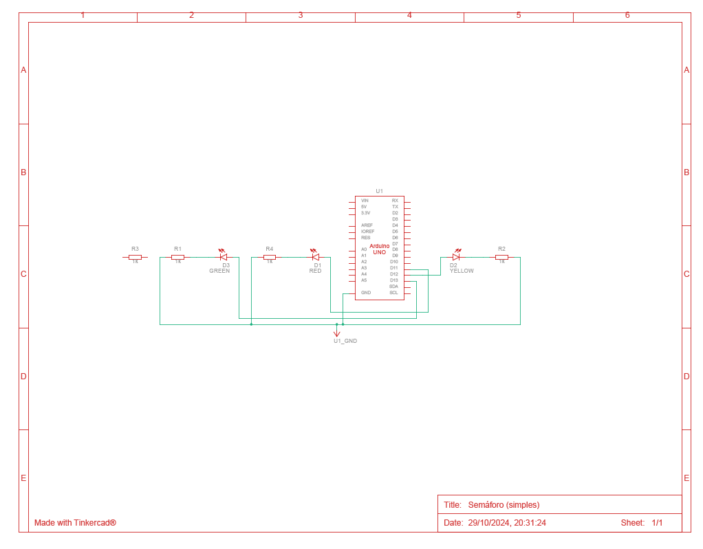

# Semáforo Simples

## Descrição

Este projeto é um semáforo simples desenvolvido para demonstrar o funcionamento de sinais de trânsito. Ele foi criado utilizando o Tinkercad, uma plataforma online para prototipagem eletrônica.

## Link do Projeto

Você pode acessar o projeto diretamente através do link abaixo:

[Semáforo Simples no Tinkercad](https://www.tinkercad.com/things/3STnfMrgrrO-semaforo-simples/editel?returnTo=https%3A%2F%2Fwww.tinkercad.com%2Fdashboard%2Fdesigns%2Fcircuits)

## Características

- **Codificação em Blocos**: A versão do semáforo utiliza uma interface de codificação em blocos, facilitando o entendimento do funcionamento e lógica por trás do projeto.
- **Componentes Utilizados**: O projeto utiliza LEDs para representar os sinais de vermelho, amarelo e verde.
- **Interatividade**: A simulação permite observar como os LEDs mudam de estado, imitando o funcionamento real de um semáforo.

## Como Usar

1. Acesse o link do projeto.
2. Explore a interface de codificação em blocos para entender a lógica por trás do semáforo.
3. Você pode modificar o código e testar diferentes sequências de sinais.

## Materias

| Quantidade | Descrição      |
| ---------- | -------------- |
| 1          | Arduino Uno R3 |
| 1          | LED Vermelho   |
| 1          | LED Amarelo    |
| 1          | LED Verde      |
| 4          | Resistor 1 kΩ  |

## Esquema do Projeto

